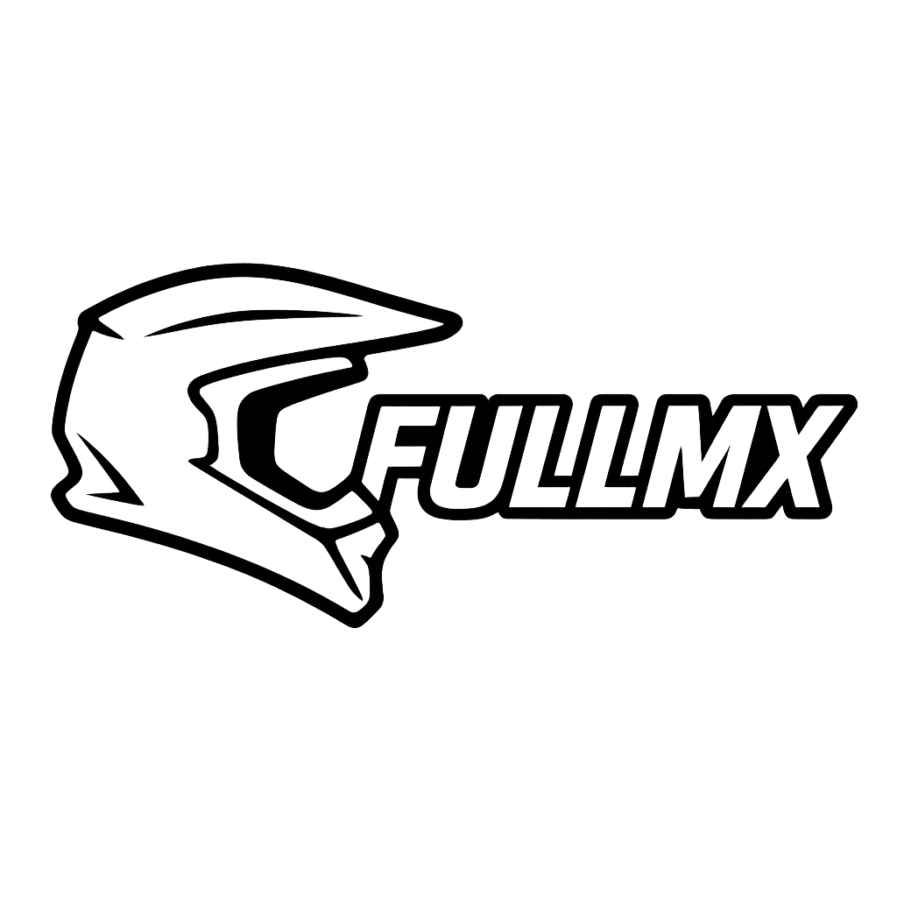
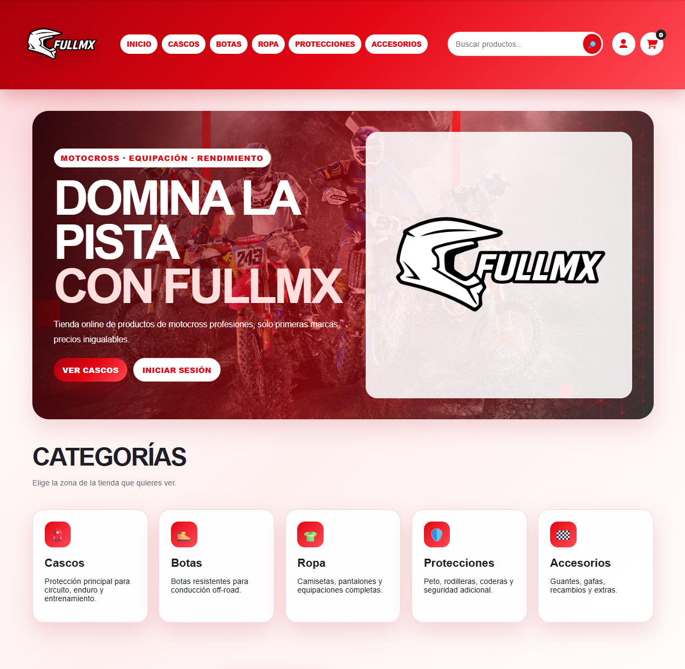
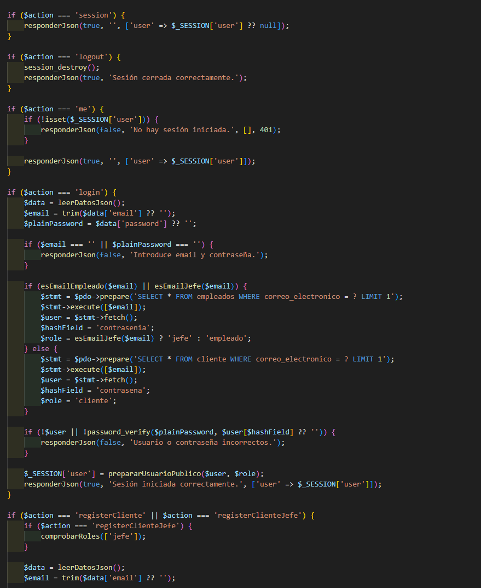
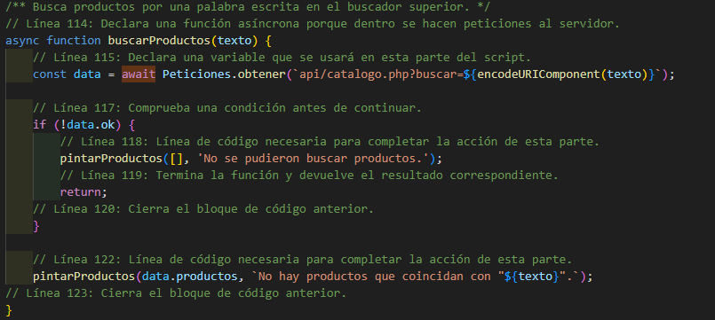
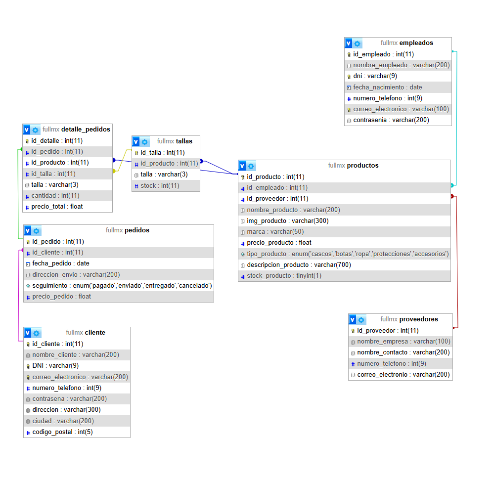
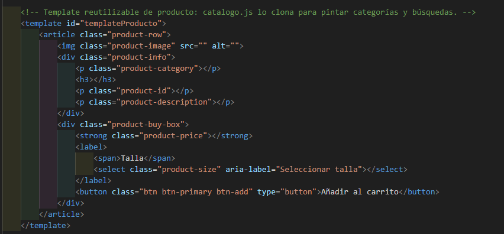
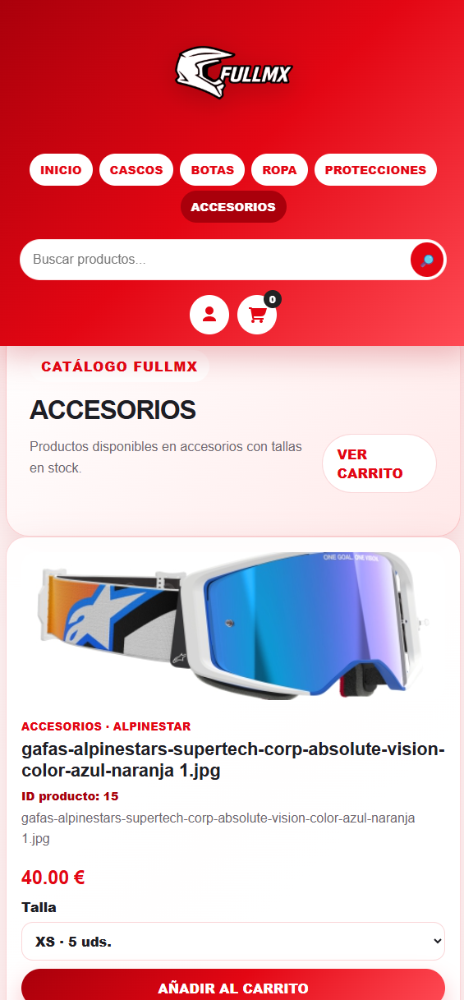

<div align="center">


# I.E.S. Suarez de Figueroa
## Desarrollo de Aplicaciones Web (DAW)



# FULL MX  
## Plataforma web de venta de productos y equipación de motocross

<br>

##### Autor del proyecto :  
Mario Guerrero Salinero
##### Tutor del proyecto :
Jose Andrés Paredes Arribas
##### Fecha de presentación  
27 de mayo de 2026
##### Repositorio GitHub :  
https://github.com/suarezfigueroa/2025-2026_MarioGuerrero/tree/main/FullMX

</div>

---

<br>


# 2. Índice

1. [Portada](#1-portada)

2. [Índice](#2-índice)

3. [Introducción](#3-introducción)

   3.1 [Descripción general del proyecto](#3-introducción)

---

4. [Objetivos del proyecto](#4-objetivos-del-proyecto)

   4.1 [Objetivo principal](#41-objetivo-principal)

   4.2 [Objetivos técnicos](#42-objetivos-técnicos)

   4.3 [Objetivos funcionales](#43-objetivos-funcionales)

   4.4 [Objetivos visuales y experiencia de usuario](#44-objetivos-visuales-y-experiencia-de-usuario)

   4.5 [Objetivos de organización y mantenimiento](#45-objetivos-de-organización-y-mantenimiento)

   4.6 [Objetivos académicos](#46-objetivos-académicos)

   4.7 [Resultado esperado](#47-resultado-esperado)

---

5. [Justificación del proyecto](#5-justificación-del-proyecto)

   5.1 [Análisis de mercado](#51-análisis-de-mercado)

   5.2 [Necesidad detectada](#52-necesidad-detectada)

   5.3 [Vinculación con los contenidos vistos en el Ciclo Formativo](#53-vinculación-con-los-contenidos-vistos-en-el-ciclo-formativo)

   5.4 [Motivación personal del proyecto](#54-motivación-personal-del-proyecto)

   5.5 [Finalidad del proyecto](#55-finalidad-del-proyecto)

---

6. [Recursos utilizados](#6-recursos-utilizados)

   6.1 [Entornos de desarrollo](#61-entornos-de-desarrollo)

   6.2 [Lenguajes de programación utilizados](#62-lenguajes-de-programación-utilizados)

   6.3 [Utilidades y recursos externos](#63-utilidades-y-recursos-externos)

   6.4 [Organización de recursos del proyecto](#64-organización-de-recursos-del-proyecto)

   6.5 [Recursos hardware utilizados](#65-recursos-hardware-utilizados)

   6.6 [Valoración de los recursos utilizados](#66-valoración-de-los-recursos-utilizados)

---

7. [Tecnologías de desarrollo](#7-tecnologías-de-desarrollo)

   7.1 [Tecnologías frontend](#71-tecnologías-frontend)

   7.2 [Tecnologías backend](#72-tecnologías-backend)

   7.3 [Tecnologías de comunicación cliente-servidor](#73-tecnologías-de-comunicación-cliente-servidor)

   7.4 [Tecnologías relacionadas con diseño responsive](#74-tecnologías-relacionadas-con-diseño-responsive)

   7.5 [Tecnologías de seguridad](#75-tecnologías-de-seguridad)

   7.6 [Valoración final de las tecnologías utilizadas](#76-valoración-final-de-las-tecnologías-utilizadas)

---

8. [Diseño del proyecto](#8-diseño-del-proyecto)

   8.1 [Diseño de la base de datos](#81-diseño-de-la-base-de-datos)

   8.2 [Diseño de la interfaz de usuario](#82-diseño-de-la-interfaz-de-usuario)

   8.3 [Roles de la aplicación](#83-roles-de-la-aplicación)

   8.4 [Usuarios creados para pruebas](#84-usuarios-creados-para-pruebas)

   8.5 [Arquitectura y organización del proyecto](#85-arquitectura-y-organización-del-proyecto)

   8.6 [Valoración final del diseño](#86-valoración-final-del-diseño)

---

9. [Lógica y codificación del proyecto](#9-lógica-y-codificación-del-proyecto)

   9.1 [Arquitectura general de la aplicación](#91-arquitectura-general-de-la-aplicación)

   9.2 [Organización interna del proyecto](#92-organización-interna-del-proyecto)

   9.3 [Principales procesos del sistema](#93-principales-procesos-del-sistema)

   9.4 [Comunicación entre frontend y backend](#94-comunicación-entre-frontend-y-backend)

   9.5 [Validación de datos](#95-validación-de-datos)

   9.6 [Sistema de sesiones y control de acceso](#96-sistema-de-sesiones-y-control-de-acceso)

   9.7 [Seguridad implementada](#97-seguridad-implementada)

   9.8 [Comentarios y documentación del código](#98-comentarios-y-documentación-del-código)

   9.9 [Valoración final de la lógica implementada](#99-valoración-final-de-la-lógica-implementada)

---

10. [Despliegue web del proyecto](#10-despliegue-web-del-proyecto)

    10.1 [Entorno de despliegue utilizado](#101-entorno-de-despliegue-utilizado)

    10.2 [Requisitos hardware y software](#102-requisitos-hardware-y-software)

    10.3 [Estructura de despliegue del proyecto](#103-estructura-de-despliegue-del-proyecto)

    10.4 [Proceso de despliegue](#104-proceso-de-despliegue)

    10.5 [Comunicación cliente-servidor](#105-comunicación-cliente-servidor)

    10.6 [Seguridad implementada en el despliegue](#106-seguridad-implementada-en-el-despliegue)

    10.7 [Posible despliegue futuro en producción](#107-posible-despliegue-futuro-en-producción)

    10.8 [Valoración final del despliegue](#108-valoración-final-del-despliegue)

---

11. [Manual de usuario](#11-manual-de-usuario)

---

12. [Conclusiones y aspectos a mejorar](#12-conclusiones-y-aspectos-a-mejorar)

    12.1 [Valoración general del proyecto](#121-valoración-general-del-proyecto)

    12.2 [Objetivos alcanzados](#122-objetivos-alcanzados)

    12.3 [Principales dificultades encontradas](#123-principales-dificultades-encontradas)

    12.4 [Aprendizajes obtenidos](#124-aprendizajes-obtenidos)

    12.5 [Experiencia personal](#125-experiencia-personal)

    12.6 [Aspectos a mejorar y futuras ampliaciones](#126-aspectos-a-mejorar-y-futuras-ampliaciones)

    12.7 [Valoración final del proyecto](#127-valoración-final-del-proyecto)

---

13. [Bibliografía](#13-bibliografía)

---

14. [Anexos](#anexos)

    14.1 [Anexo I — Estructura general del proyecto](#anexo-i--estructura-general-del-proyecto)

    14.2 [Anexo II — Capturas del proyecto](#anexo-ii--capturas-del-proyecto)
    <br>

---

# 3. Introducción

FULL MX es una aplicación web desarrollada como Proyecto Final del Ciclo Formativo de Grado Superior en Desarrollo de Aplicaciones Web (DAW). Este proyecto nace con el objetivo de diseñar y desarrollar una plataforma de comercio electrónico moderna, visual y funcional, especializada en la venta de productos y equipación de motocross.

La idea principal del proyecto surge a partir del crecimiento actual del comercio electrónico y de la gran expansión que está teniendo el sector del motocross y los deportes offroad. Actualmente existen numerosas tiendas online dedicadas a este ámbito, aunque muchas de ellas presentan interfaces poco intuitivas, diseños anticuados o experiencias de usuario poco dinámicas. Debido a ello, se planteó la posibilidad de crear una plataforma propia que ofreciera una experiencia mucho más moderna, visualmente atractiva y sencilla de utilizar.

FULL MX pretende simular el funcionamiento real de una tienda online profesional, permitiendo tanto la gestión interna de productos y usuarios como la interacción de clientes finales mediante compras online. Para ello, se ha desarrollado un sistema completo con distintos tipos de usuarios, gestión de productos, control de stock por tallas, carrito de compra dinámico y visualización de pedidos realizados.

Uno de los aspectos más importantes del proyecto ha sido conseguir una correcta separación entre frontend y backend, manteniendo una estructura organizada y fácil de mantener. La aplicación ha sido desarrollada utilizando tecnologías vistas durante el ciclo formativo como HTML, CSS, JavaScript, PHP y MySQL, integrando conocimientos relacionados con el desarrollo web en entorno cliente y entorno servidor, bases de datos relacionales, diseño responsive y gestión de sesiones.

En la parte frontend se ha trabajado principalmente en la creación de una interfaz visual moderna e intuitiva, desarrollando un sistema dinámico capaz de cargar productos, mostrar información en tiempo real y actualizar distintos elementos de la página sin necesidad de recargar continuamente el navegador. Para ello se han utilizado funcionalidades avanzadas de JavaScript junto con manipulación del DOM y peticiones asíncronas entre cliente y servidor.

En la parte backend se ha implementado toda la lógica relacionada con usuarios, sesiones, consultas SQL y gestión de productos y pedidos. La aplicación cuenta con distintos roles de usuario, cada uno con permisos específicos dentro de la plataforma:

- Clientes.
- Empleados.
- Administradores o jefe.

Cada uno de estos roles dispone de diferentes funcionalidades dentro de la aplicación. Los clientes pueden realizar compras y consultar sus pedidos, mientras que empleados y administradores disponen de herramientas adicionales para gestionar productos, actualizar stock, consultar pedidos o administrar empleados.

Otro de los aspectos fundamentales del proyecto ha sido el diseño de la base de datos relacional. La estructura desarrollada permite gestionar correctamente productos, proveedores, usuarios, pedidos, detalles de pedidos y stock por tallas, manteniendo relaciones entre tablas mediante claves primarias y foráneas. Esto permite que la aplicación mantenga una estructura sólida y escalable, preparada para futuras ampliaciones o nuevas funcionalidades.

Además de la funcionalidad principal de compra online, también se han implementado diferentes características orientadas a mejorar la experiencia de usuario y dar un aspecto más profesional a la aplicación, entre las que destacan:

- Buscador dinámico de productos.
- Carrito lateral interactivo.
- Gestión de cantidades dentro del carrito.
- Sistema de popups dinámicos.
- Visualización detallada de pedidos.
- Sistema de control de stock.
- Gestión de productos por tallas.
- Diseño responsive adaptable a distintos dispositivos.

Durante el desarrollo del proyecto también se ha trabajado la organización interna del código, manteniendo una arquitectura basada en carpetas separadas para CSS, JavaScript, vistas, APIs y recursos gráficos. Además, se han añadido comentarios explicativos dentro del código para facilitar su comprensión y mantenimiento.

FULL MX no solo representa una práctica académica, sino también una simulación bastante cercana al desarrollo de una aplicación web profesional real. Gracias a este proyecto ha sido posible aplicar de forma práctica gran parte de los conocimientos adquiridos durante el ciclo formativo, enfrentándose a problemas reales relacionados con diseño web, organización del código, comunicación entre frontend y backend, seguridad, experiencia de usuario y gestión de bases de datos.

Finalmente, el resultado obtenido es una plataforma web completamente funcional, visualmente moderna y preparada para seguir creciendo en futuras versiones, pudiendo incorporar nuevas funcionalidades propias de una tienda online profesional real.

---

---


# 4. Objetivos del proyecto

El desarrollo del proyecto FULL MX ha sido planteado con el objetivo de crear una aplicación web moderna, funcional y visualmente atractiva orientada al sector del motocross y la venta online de equipación deportiva.

A lo largo del desarrollo se han establecido una serie de objetivos tanto técnicos como funcionales y visuales, buscando no solo aplicar los conocimientos adquiridos durante el Ciclo Formativo de Desarrollo de Aplicaciones Web, sino también simular el funcionamiento real de una plataforma profesional de comercio electrónico.

El proyecto ha sido desarrollado intentando mantener una estructura organizada y escalable, permitiendo incorporar futuras mejoras y nuevas funcionalidades.

---

## 4.1 Objetivo principal

El principal objetivo del proyecto ha sido desarrollar una plataforma web completa para la gestión y venta de productos de motocross, implementando tanto funcionalidades frontend como backend y manteniendo una experiencia de usuario moderna y dinámica.

La aplicación debía cumplir una serie de requisitos fundamentales:

- Ser completamente funcional.
- Tener un diseño moderno y atractivo.
- Permitir la navegación intuitiva.
- Gestionar usuarios mediante sesiones.
- Gestionar productos y pedidos.
- Mantener una correcta organización del código.
- Utilizar una base de datos relacional.
- Simular un entorno profesional real.

Además, se buscó desarrollar una aplicación que pudiera seguir ampliándose en futuras versiones sin necesidad de rehacer completamente la estructura principal del sistema.

---

## 4.2 Objetivos técnicos

Uno de los principales propósitos del proyecto ha sido aplicar de forma práctica los conocimientos técnicos aprendidos durante el ciclo formativo DAW.

Para ello se establecieron diferentes objetivos relacionados con el desarrollo frontend, backend y bases de datos.

### 4.2.1 Desarrollo frontend

En la parte frontend se buscó desarrollar una interfaz moderna y dinámica utilizando tecnologías web actuales.

Los principales objetivos fueron:

- Crear una interfaz visual atractiva.
- Implementar navegación dinámica.
- Diseñar templates reutilizables.
- Mejorar la experiencia de usuario.
- Aplicar diseño responsive.
- Crear popups dinámicos.
- Implementar efectos visuales y animaciones suaves.
- Mantener una correcta organización del CSS.

Además, se buscó crear una experiencia visual inspirada en plataformas reales de comercio electrónico relacionadas con deportes extremos y motocross.

---

### 4.2.2 Desarrollo backend

En la parte backend el objetivo principal fue desarrollar una estructura funcional y segura capaz de gestionar toda la lógica de la aplicación.

Los objetivos planteados fueron:

- Gestionar usuarios mediante sesiones PHP.
- Crear un sistema de autenticación.
- Gestionar productos desde base de datos.
- Gestionar pedidos.
- Gestionar stock por tallas.
- Gestionar empleados y administradores.
- Validar datos enviados desde formularios.
- Realizar consultas SQL eficientes.

También se buscó mantener una estructura organizada separando correctamente frontend y backend.

---

### 4.2.3 Gestión de base de datos

Otro de los objetivos fundamentales del proyecto fue diseñar una base de datos relacional correctamente estructurada.

La base de datos debía permitir:

- Gestionar productos.
- Gestionar clientes.
- Gestionar empleados.
- Gestionar pedidos.
- Gestionar detalles de pedidos.
- Gestionar tallas y stock.
- Gestionar proveedores.

Además, era importante mantener relaciones correctas entre tablas utilizando claves primarias y claves foráneas.

---

## 4.3 Objetivos funcionales

Desde el punto de vista funcional, la aplicación debía simular el comportamiento real de una tienda online moderna.

### 4.3.1 Gestión de usuarios

La aplicación debía permitir:

- Registro de clientes.
- Inicio de sesión.
- Gestión de sesiones.
- Diferenciación de roles.
- Control de acceso según permisos.

Se implementaron tres tipos de usuarios:

| Rol | Funcionalidad |
|---|---|
| Cliente | Comprar y consultar pedidos |
| Empleado | Gestionar productos y stock |
| Jefe | Administración completa |

---

### 4.3.2 Gestión de productos

La aplicación debía permitir:

- Mostrar productos dinámicamente.
- Buscar productos.
- Filtrar por categorías.
- Añadir productos al carrito.
- Gestionar stock por tallas.
- Actualizar stock.
- Borrar productos.

Además, los productos debían mostrar:

- Imagen.
- Nombre.
- Identificador.
- Precio.
- Descripción.
- Tallas disponibles.

---

### 4.3.3 Sistema de carrito

Uno de los objetivos principales fue desarrollar un carrito dinámico e intuitivo.

El carrito debía permitir:

- Añadir productos.
- Seleccionar tallas.
- Modificar cantidades.
- Eliminar productos.
- Mostrar precio total.
- Confirmar pedidos.

Toda la lógica debía funcionar dinámicamente utilizando JavaScript sin necesidad de recargar continuamente la página.

---

### 4.3.4 Gestión de pedidos

La aplicación debía permitir almacenar pedidos correctamente en la base de datos y mostrarlos posteriormente al cliente.

Cada pedido debía contener:

- Productos comprados.
- Cantidad de cada producto.
- Precio total.
- Fecha del pedido.
- Relación con el cliente.

También se implementó un popup dinámico para mostrar el detalle completo de cada pedido.

---

## 4.4 Objetivos visuales y experiencia de usuario

El aspecto visual de la aplicación ha sido uno de los puntos más importantes durante el desarrollo del proyecto.

Se buscó crear una interfaz:

- Moderna.
- Deportiva.
- Visualmente atractiva.
- Dinámica.
- Profesional.

Para ello se utilizaron colores relacionados con el mundo del motocross:

- Rojo.
- Blanco.
- Negro.

También se implementaron:

- Animaciones suaves.
- Hover effects.
- Popups.
- Tarjetas dinámicas.
- Transiciones.
- Botones interactivos.

El objetivo principal era conseguir una experiencia de usuario cómoda y atractiva.

---

## 4.5 Objetivos de organización y mantenimiento

Otro de los objetivos fundamentales fue mantener una estructura de proyecto organizada y fácil de mantener.

Para ello se creó una arquitectura separada en carpetas:

```txt
/css
/js
/api
/vistas
/img
/logos
```

Esta estructura permite:

- Mantener el código ordenado.
- Facilitar futuras modificaciones.
- Mejorar la legibilidad.
- Facilitar el mantenimiento del proyecto.

Además, se añadieron comentarios explicativos dentro del código para mejorar su comprensión.

---

## 4.6 Objetivos académicos

El proyecto también tenía una finalidad académica importante.

Los principales objetivos académicos fueron:

- Aplicar conocimientos del ciclo DAW.
- Mejorar la capacidad de organización.
- Aprender a estructurar proyectos reales.
- Integrar frontend y backend.
- Trabajar con bases de datos reales.
- Mejorar habilidades de diseño web.
- Comprender la arquitectura cliente-servidor.
- Mejorar la capacidad de resolución de problemas.

Gracias al desarrollo de FULL MX se ha conseguido adquirir una experiencia práctica muy cercana a un entorno profesional real.

---
## 4.7 Resultado esperado

El resultado final esperado del proyecto era obtener una aplicación web completamente funcional y visualmente profesional capaz de representar una tienda online moderna especializada en motocross.

La aplicación final debía:

- Funcionar correctamente.
- Tener un diseño moderno.
- Ser responsive.
- Mantener una estructura organizada.
- Utilizar una base de datos relacional.
- Gestionar usuarios y pedidos.
- Permitir futuras ampliaciones.

Finalmente, FULL MX ha conseguido cumplir los objetivos planteados inicialmente, dando como resultado una plataforma sólida, dinámica y funcional.

---

# 5. Justificación del proyecto

El desarrollo del proyecto FULL MX surge como respuesta a la creciente importancia que tiene actualmente el comercio electrónico dentro de prácticamente todos los sectores comerciales, especialmente en ámbitos relacionados con el deporte, la equipación técnica y los productos especializados. En los últimos años, las tiendas online han evolucionado considerablemente, ofreciendo experiencias cada vez más visuales, dinámicas e intuitivas para los usuarios. Debido a ello, se consideró interesante desarrollar una plataforma propia orientada específicamente al mundo del motocross y los deportes offroad.

La principal idea del proyecto ha sido crear una aplicación web moderna y funcional que simule el funcionamiento real de una tienda online profesional, aplicando los conocimientos adquiridos durante el Ciclo Formativo de Desarrollo de Aplicaciones Web y enfrentándose a situaciones similares a las que podrían aparecer dentro de un entorno profesional real de desarrollo.

Además de la parte técnica, FULL MX también surge como un proyecto motivado por el interés personal en el mundo del motocross y la posibilidad de desarrollar una plataforma visualmente atractiva, dinámica y centrada en la experiencia del usuario.

---


## 5.1 Análisis de mercado

Actualmente existen numerosas plataformas dedicadas a la venta online de productos relacionados con el motocross y los deportes extremos. Sin embargo, tras realizar un análisis general del mercado, se pudo observar que muchas de estas páginas presentan ciertos problemas relacionados con la experiencia de usuario, la organización visual o la navegación de la plataforma.

Entre los principales problemas detectados destacan:

- Interfaces demasiado recargadas.
- Diseños poco modernos.
- Navegación compleja.
- Mala adaptación a dispositivos móviles.
- Falta de dinamismo.
- Sistemas de compra poco intuitivos.
- Sobrecarga de información visual.

A partir de este análisis se decidió desarrollar una plataforma propia que intentase solucionar estos problemas mediante una interfaz más moderna, limpia y visualmente atractiva.

FULL MX ha sido diseñada intentando transmitir una estética agresiva y deportiva inspirada en el mundo del motocross, utilizando colores corporativos relacionados con este sector, especialmente tonos rojos, blancos y negros.

Además del aspecto visual, otro de los objetivos del proyecto ha sido mejorar la interacción del usuario mediante elementos dinámicos como:

- Popups interactivos.
- Carrito lateral dinámico.
- Buscador de productos.
- Templates reutilizables.
- Efectos visuales.
- Animaciones suaves.
- Navegación intuitiva.

---

### Plataformas analizadas como referencia

Durante el desarrollo del proyecto se tomaron como referencia visual y funcional distintas plataformas reales relacionadas con la venta de equipación deportiva y motocross.

| Plataforma | Características observadas |
|---|---|
| 24MX | Diseño moderno y catálogo amplio |
| Motocard | Navegación organizada y visual |
| GreenlandMX | Especialización en motocross |
| FC-Moto | Plataforma internacional con gran variedad |
| Motosport | Amplio catálogo de productos deportivos |

Estas plataformas sirvieron principalmente como inspiración visual y funcional para desarrollar una aplicación propia con identidad y estructura personalizada.

No obstante, FULL MX ha sido desarrollada completamente desde cero utilizando tecnologías web vistas durante el ciclo formativo.

---

## 5.2 Necesidad detectada

Uno de los principales motivos que justifican el desarrollo del proyecto ha sido la necesidad de crear una aplicación capaz de integrar múltiples funcionalidades dentro de una única plataforma moderna y organizada.

El proyecto permite combinar diferentes áreas del desarrollo web como:

- Diseño de interfaces.
- Desarrollo frontend.
- Desarrollo backend.
- Bases de datos.
- Gestión de usuarios.
- Gestión de stock.
- Comunicación cliente-servidor.
- Seguridad y sesiones.

Además, se buscó crear una plataforma que pudiera ampliarse fácilmente en el futuro, manteniendo una estructura organizada y escalable.

FULL MX no ha sido planteada únicamente como una práctica académica, sino también como una simulación bastante cercana al desarrollo de una aplicación web real de comercio electrónico.

---


## 5.3 Vinculación con los contenidos vistos en el Ciclo Formativo

El proyecto FULL MX ha permitido aplicar de forma práctica una gran cantidad de conocimientos aprendidos durante el Ciclo Formativo de Desarrollo de Aplicaciones Web.

Gracias al desarrollo del proyecto se han trabajado contenidos relacionados con prácticamente todos los módulos principales del ciclo.

### Desarrollo Web en Entorno Cliente

En este módulo se han aplicado conocimientos relacionados con:

- JavaScript.
- Manipulación del DOM.
- Eventos.
- Templates dinámicos.
- Popups.
- Fetch API.
- Validación de formularios.
- Interacción dinámica.

Se ha trabajado especialmente la comunicación dinámica entre frontend y backend utilizando peticiones asíncronas.

---

### Desarrollo Web en Entorno Servidor

En la parte backend se han aplicado conocimientos relacionados con:

- PHP.
- Gestión de sesiones.
- Validación de usuarios.
- Consultas SQL.
- Gestión de stock.
- Gestión de pedidos.
- Control de acceso.
- Arquitectura cliente-servidor.

La aplicación incorpora distintos niveles de acceso dependiendo del tipo de usuario conectado.

---

### Bases de Datos

La base de datos desarrollada ha permitido aplicar conocimientos relacionados con:

- Diseño relacional.
- Relaciones entre tablas.
- Claves primarias.
- Claves foráneas.
- Consultas SQL.
- Gestión de stock por tallas.
- Relación entre productos y pedidos.

El diseño de la base de datos ha sido uno de los puntos más importantes del proyecto, ya que gran parte del funcionamiento de la aplicación depende de una correcta organización de la información.

---

### Diseño de Interfaces Web

En este módulo se han aplicado conocimientos relacionados con:

- Responsive Design.
- Diseño visual.
- Experiencia de usuario.
- Diseño comercial.
- Jerarquía visual.
- Colores corporativos.
- Animaciones y efectos CSS.

El objetivo principal fue conseguir una interfaz moderna y profesional inspirada en plataformas reales de comercio electrónico.

---

### Despliegue de Aplicaciones Web

El proyecto también ha permitido trabajar aspectos relacionados con el despliegue y configuración de aplicaciones web:

- Configuración de Apache.
- Uso de XAMPP.
- Variables de entorno.
- Archivo .htaccess.
- Organización del proyecto.

---

## 5.4 Motivación personal del proyecto

La elección de este proyecto también se encuentra relacionada con el interés personal en el mundo del motocross y los deportes de motor.

Desarrollar una aplicación relacionada con un ámbito conocido y de interés personal ha permitido trabajar con mayor motivación durante todas las fases del proyecto, dedicando especial atención tanto al diseño visual como a la experiencia de usuario.

Además, el proyecto ha servido como una oportunidad para desarrollar una aplicación mucho más cercana a un entorno real de trabajo, enfrentándose a problemas relacionados con:

- Organización del código.
- Gestión de usuarios.
- Diseño visual.
- Bases de datos.
- Comunicación frontend-backend.
- Seguridad.
- Experiencia de usuario.

Gracias a ello, FULL MX ha supuesto una experiencia práctica muy completa dentro del aprendizaje del desarrollo web.

---

## 5.5 Finalidad del proyecto

La finalidad principal de FULL MX ha sido desarrollar una aplicación web completa capaz de demostrar los conocimientos adquiridos durante el ciclo formativo y servir como ejemplo práctico de un proyecto real de comercio electrónico.

Además de la parte académica, el proyecto también ha permitido:

- Mejorar habilidades de programación.
- Aprender a organizar proyectos grandes.
- Comprender la arquitectura cliente-servidor.
- Trabajar con bases de datos reales.
- Mejorar conocimientos de diseño web.
- Simular un entorno profesional de desarrollo.

El resultado final es una plataforma funcional, dinámica y escalable que podría continuar ampliándose con nuevas funcionalidades en futuras versiones.

---

# 6. Recursos utilizados

Durante el desarrollo del proyecto FULL MX se han utilizado diferentes recursos hardware y software con el objetivo de crear una aplicación web moderna, organizada y completamente funcional. La selección de herramientas y tecnologías utilizadas ha permitido trabajar de forma profesional durante todas las fases del desarrollo, facilitando tanto la programación como el diseño, las pruebas y la gestión de la base de datos.

Además de las herramientas de desarrollo, también se han utilizado diferentes recursos visuales y utilidades externas que han permitido mejorar la estética de la aplicación y optimizar el flujo de trabajo durante la realización del proyecto.

---

# 6.1 Entornos de desarrollo

Para el desarrollo del proyecto se han utilizado distintos entornos y herramientas de programación orientadas al desarrollo web frontend y backend.

Cada herramienta ha sido seleccionada en función de las necesidades específicas del proyecto.

---

## 6.1.1 Visual Studio Code

Visual Studio Code ha sido el entorno de desarrollo principal utilizado durante todo el proyecto.

Este IDE ha permitido trabajar cómodamente tanto en la parte frontend como backend de la aplicación, gracias a su compatibilidad con múltiples lenguajes y extensiones.

### Funciones principales utilizadas

- Edición de código HTML.
- Edición de CSS.
- Programación JavaScript.
- Desarrollo PHP.
- Organización de carpetas.
- Integración con GitHub.
- Autocompletado de código.
- Resaltado de sintaxis.
- Gestión de extensiones.

### Ventajas de utilización

- Ligereza y rendimiento.
- Compatibilidad multiplataforma.
- Gran cantidad de extensiones.
- Interfaz intuitiva.
- Fácil organización del proyecto.

---
## 6.1.2 XAMPP

XAMPP ha sido utilizado como entorno local de desarrollo para ejecutar el servidor Apache y gestionar la base de datos MySQL.

Gracias a esta herramienta ha sido posible ejecutar el proyecto de forma local simulando un entorno real de servidor web.

### Servicios utilizados

| Servicio | Función |
|---|---|
| Apache | Servidor web |
| MySQL | Gestión base de datos |
| phpMyAdmin | Administración de MySQL |

### Funcionalidades principales

- Ejecución local del proyecto.
- Gestión del servidor Apache.
- Gestión de bases de datos.
- Pruebas de conexión frontend-backend.
- Simulación de entorno real.

---

## 6.1.3 phpMyAdmin

phpMyAdmin ha sido utilizado para la gestión visual de la base de datos del proyecto.

Esta herramienta ha permitido:

- Crear tablas.
- Modificar estructuras.
- Ejecutar consultas SQL.
- Insertar registros.
- Eliminar datos.
- Gestionar relaciones entre tablas.

Además, ha facilitado enormemente las pruebas relacionadas con productos, usuarios y pedidos.

---

## 6.1.4 GitHub

GitHub ha sido utilizado como sistema de control de versiones y almacenamiento del proyecto.

Su utilización ha permitido:

- Guardar versiones del proyecto.
- Mantener copias de seguridad.
- Organizar cambios.
- Compartir el código.
- Gestionar el repositorio.

Además, GitHub ha facilitado la organización del proyecto y el seguimiento del desarrollo realizado.

---


# 6.2 Lenguajes de programación utilizados

Durante el desarrollo de FULL MX se han utilizado distintos lenguajes de programación y tecnologías web, cada uno enfocado en una parte concreta del proyecto.

---

## 6.2.1 HTML5

HTML5 ha sido utilizado para estructurar todas las páginas y vistas de la aplicación.

Gracias a HTML ha sido posible construir:

- Estructura principal de páginas.
- Formularios.
- Templates de productos.
- Popups.
- Estructuras de navegación.
- Contenedores dinámicos.

Además, se han utilizado etiquetas semánticas para mejorar la organización y legibilidad del código.

### Uso dentro del proyecto

- Página principal.
- Inicio de sesión.
- Registro de usuarios.
- Paneles de usuario.
- Categorías de productos.
- Política de privacidad.
- Formularios dinámicos.

---

## 6.2.2 CSS3

CSS3 ha sido utilizado para el diseño visual completo de la aplicación.

Se ha trabajado especialmente en crear una estética moderna y deportiva relacionada con el mundo del motocross.

### Características implementadas

- Diseño responsive.
- Efectos hover.
- Animaciones.
- Popups dinámicos.
- Tarjetas de productos.
- Diseño adaptable.
- Flexbox.
- Grid Layout.
- Sombras y transiciones.

### Paleta de colores utilizada

| Color | Función |
|---|---|
| Rojo | Color corporativo principal |
| Blanco | Fondos y contraste |
| Negro | Detalles y profundidad visual |

Además, el CSS se ha organizado mediante bloques comentados para facilitar su mantenimiento y comprensión.

---

## 6.2.3 JavaScript

JavaScript ha sido uno de los lenguajes más importantes dentro del proyecto, ya que se ha utilizado para toda la lógica dinámica del frontend.

Gracias a JavaScript se han implementado funcionalidades como:

- Carrito dinámico.
- Templates reutilizables.
- Gestión de cantidades.
- Búsqueda de productos.
- Popups.
- Actualización dinámica de contenido.
- Comunicación con el backend.
- Gestión de eventos.

### Funcionalidades principales desarrolladas

#### Gestión del carrito

Permite:

- Añadir productos.
- Modificar cantidades.
- Eliminar artículos.
- Actualizar precios.

#### Sistema de búsqueda

Permite buscar productos dinámicamente mediante palabras clave.

#### Gestión de popups

Utilizados para:

- Detalle de pedidos.
- Contacto.
- Confirmaciones.

#### Comunicación con PHP

Se utiliza Fetch API para enviar y recibir datos desde el backend.

---

## 6.2.4 PHP

PHP ha sido utilizado para desarrollar toda la lógica backend de la aplicación.

La mayor parte de la comunicación con la base de datos y la gestión de usuarios se realiza mediante archivos PHP.

### Funcionalidades implementadas

- Inicio de sesión.
- Registro de usuarios.
- Gestión de sesiones.
- Consultas SQL.
- Gestión de productos.
- Gestión de pedidos.
- Gestión de stock.
- Control de acceso.

### Gestión de sesiones

Todos los usuarios funcionan mediante sesiones PHP para mantener la autenticación mientras navegan por la aplicación.

### Seguridad implementada

- Contraseñas cifradas mediante hash.
- Restricción de acceso.
- Variables de entorno.
- Separación frontend/backend.

---

## 6.2.5 SQL y MySQL

MySQL ha sido utilizado como sistema gestor de base de datos relacional.

La base de datos diseñada permite gestionar correctamente toda la información necesaria para el funcionamiento de la plataforma.

### Información gestionada

- Productos.
- Usuarios.
- Pedidos.
- Tallas.
- Proveedores.
- Stock.
- Detalles de pedidos.

### Consultas realizadas

- INSERT.
- SELECT.
- UPDATE.
- DELETE.

También se han utilizado relaciones entre tablas mediante claves primarias y claves foráneas.

---

# 6.3 Utilidades y recursos externos

Además de las herramientas principales de desarrollo, también se han utilizado diferentes recursos externos que han ayudado a mejorar la calidad visual y funcional del proyecto.

---

## 6.3.1 Font Awesome

Font Awesome ha sido utilizado para incorporar iconos dentro de la aplicación.

### Iconos utilizados

- Carrito.
- Usuario.
- Búsqueda.
- Cierre de popups.
- Gestión de productos.

### Ventajas

- Diseño moderno.
- Fácil integración.
- Gran variedad de iconos.
- Escalabilidad visual.

URL: https://fontawesome.com

---

Imagen: Iconos utilizados dentro de FULL MX.

---

## 6.3.2 Google Fonts

Google Fonts ha sido utilizado para mejorar la tipografía de la aplicación.

Esto ha permitido conseguir una apariencia más moderna y profesional.

URL: https://fonts.google.com

---

## 6.3.3 Recursos gráficos

Durante el desarrollo se han utilizado imágenes relacionadas con el motocross para mejorar la estética visual de la aplicación.

Las imágenes utilizadas corresponden principalmente a:

- Cascos.
- Botas.
- Ropa deportiva.
- Motocross.
- Fondos decorativos.

Estos recursos han sido utilizados únicamente con fines educativos y de demostración dentro del proyecto.

---

## 6.3.4 GitHub

GitHub ha sido utilizado tanto para almacenamiento como para control de versiones.

### Funciones utilizadas

- Repositorio remoto.
- Gestión de versiones.
- Backup del proyecto.
- Compartición de código.

URL: https://github.com

---
# 6.4 Organización de recursos del proyecto

El proyecto ha sido organizado mediante distintas carpetas para separar correctamente cada tipo de recurso.

La estructura utilizada ha sido la siguiente:

```txt
/css
/js
/api
/vistas
/img
/logos
index.html
```

## Descripción de carpetas

| Carpeta | Función |
|---|---|
| css | Archivos de estilos |
| js | Archivos JavaScript |
| api | Backend PHP |
| vistas | Vistas HTML |
| img | Imágenes productos |
| logos | Iconografía y logotipos |
| index.html | Pagina principal |

Esta organización ha permitido mantener una estructura limpia, organizada y fácil de mantener.

---

# 6.5 Recursos hardware utilizados

Aunque el proyecto ha sido desarrollado principalmente a nivel software, también se han utilizado distintos recursos hardware.

### Hardware utilizado

- Ordenador personal.
- Monitor externo.
- Ratón y teclado.
- Conexión a internet.

### Características necesarias

- Navegador actualizado.
- Entorno XAMPP.
- Sistema operativo compatible.

---

# 6.6 Valoración de los recursos utilizados

La combinación de herramientas, tecnologías y recursos utilizados ha permitido desarrollar el proyecto de forma eficiente y organizada.

Gracias a estos recursos ha sido posible:

- Mantener un flujo de trabajo profesional.
- Organizar correctamente el código.
- Desarrollar una interfaz moderna.
- Gestionar correctamente la base de datos.
- Simular un entorno real de comercio electrónico.

Todos los recursos utilizados han resultado fundamentales para conseguir el resultado final del proyecto FULL MX.

---

# 7. Tecnologías de desarrollo

Durante el desarrollo del proyecto FULL MX se han utilizado distintas tecnologías orientadas tanto al desarrollo frontend como backend de aplicaciones web. La combinación de estas tecnologías ha permitido crear una plataforma moderna, dinámica y completamente funcional, simulando el funcionamiento real de una tienda online profesional.

La elección de cada tecnología ha sido realizada teniendo en cuenta diferentes aspectos como:

- Rendimiento.
- Facilidad de desarrollo.
- Compatibilidad.
- Escalabilidad.
- Organización del proyecto.
- Aprendizaje adquirido durante el ciclo formativo.

Además, todas las tecnologías utilizadas forman parte de los contenidos trabajados durante el Ciclo Formativo de Desarrollo de Aplicaciones Web, permitiendo aplicar de forma práctica conocimientos relacionados con programación web, bases de datos, diseño de interfaces y comunicación cliente-servidor.

---


# 7.1 Tecnologías frontend

Las tecnologías frontend son aquellas encargadas de la parte visual e interactiva de la aplicación, es decir, todo aquello con lo que interactúa directamente el usuario desde el navegador.

Dentro de FULL MX, las tecnologías frontend han tenido un papel fundamental para conseguir una experiencia visual moderna, dinámica y profesional.

---

## 7.1.1 HTML5

HTML5 ha sido utilizado como lenguaje principal para estructurar todas las páginas y componentes de la aplicación.

Gracias a HTML se ha podido construir toda la estructura visual del proyecto, incluyendo:

- Página principal.
- Formularios.
- Navegación.
- Templates de productos.
- Popups.
- Carrito lateral.
- Paneles de usuario.
- Categorías de productos.

### Motivos de utilización

HTML5 ha sido elegido debido a:

- Su facilidad de uso.
- Compatibilidad con navegadores modernos.
- Integración sencilla con CSS y JavaScript.
- Capacidad para crear estructuras semánticas organizadas.

### Ventajas frente a otras alternativas

- Estándar universal del desarrollo web.
- Gran compatibilidad.
- Estructura clara y organizada.
- Facilidad de mantenimiento.

---


## 7.1.2 CSS3

CSS3 ha sido utilizado para todo el diseño visual de la aplicación.

Uno de los principales objetivos del proyecto ha sido crear una plataforma moderna y visualmente atractiva, por lo que CSS ha tenido una gran importancia durante el desarrollo.

### Funcionalidades implementadas

Con CSS se han desarrollado:

- Diseños responsive.
- Efectos hover.
- Animaciones.
- Popups.
- Tarjetas dinámicas.
- Sombras y transiciones.
- Distribuciones flexibles mediante Flexbox.
- Distribuciones complejas mediante Grid Layout.

### Diseño visual

La estética visual del proyecto está basada principalmente en colores relacionados con el mundo del motocross:

| Color | Uso principal |
|---|---|
| Rojo | Color corporativo y botones |
| Blanco | Fondos y contraste |
| Negro | Detalles visuales y profundidad |

### Responsive Design

Uno de los aspectos más importantes ha sido conseguir una correcta adaptación a diferentes dispositivos:

- Ordenadores.
- Tablets.
- Smartphones.

### Motivos de utilización

CSS3 ha sido utilizado debido a:

- Su flexibilidad visual.
- Compatibilidad con navegadores modernos.
- Capacidad para crear animaciones.
- Integración sencilla con HTML.

### Ventajas frente a frameworks externos

Aunque existen frameworks como Bootstrap o Tailwind, se decidió utilizar CSS puro para:

- Tener mayor control del diseño.
- Personalizar completamente la interfaz.
- Mejorar el aprendizaje práctico.
- Evitar dependencia de librerías externas.

---


## 7.1.3 JavaScript

JavaScript ha sido una de las tecnologías más importantes del proyecto, ya que se ha utilizado para toda la lógica dinámica del frontend.

Gracias a JavaScript la aplicación es capaz de actualizar contenido dinámicamente sin necesidad de recargar constantemente la página.

### Funcionalidades implementadas

#### Sistema de carrito dinámico

Permite:

- Añadir productos.
- Eliminar artículos.
- Modificar cantidades.
- Actualizar precios automáticamente.

#### Sistema de búsqueda

Permite buscar productos dinámicamente mediante palabras clave introducidas por el usuario.

#### Templates dinámicos

Los productos y pedidos se generan automáticamente utilizando plantillas dinámicas creadas mediante JavaScript.

#### Gestión de popups

Se utilizan popups para:

- Contacto.
- Detalle de pedidos.
- Confirmaciones.
- Información adicional.

#### Gestión de eventos

JavaScript controla:

- Clicks.
- Formularios.
- Navegación dinámica.
- Eventos hover.
- Apertura y cierre de ventanas emergentes.

### Fetch API

Se ha utilizado Fetch API para realizar comunicación entre frontend y backend mediante peticiones asíncronas.

Gracias a ello ha sido posible:

- Obtener productos.
- Validar usuarios.
- Consultar pedidos.
- Actualizar stock.
- Gestionar carrito.

### Motivos de utilización

JavaScript ha sido elegido debido a:

- Ser el lenguaje estándar del frontend.
- Permitir interacción dinámica.
- Integrarse perfectamente con HTML y CSS.
- Tener compatibilidad total con navegadores modernos.

---

Imagen: Código JavaScript utilizado para gestionar productos dinámicos.

Imagen: Sistema de carrito desarrollado mediante JavaScript.

---

# 7.2 Tecnologías backend

Las tecnologías backend son aquellas encargadas de la lógica interna de la aplicación y de la comunicación con la base de datos.

En FULL MX, el backend se ha desarrollado principalmente utilizando PHP y MySQL.

---

## 7.2.1 PHP

PHP ha sido utilizado como lenguaje principal del backend.

Gracias a PHP ha sido posible desarrollar toda la lógica relacionada con:

- Usuarios.
- Sesiones.
- Consultas SQL.
- Gestión de pedidos.
- Gestión de productos.
- Validaciones.
- Control de acceso.

### Funcionalidades implementadas

#### Inicio de sesión

El sistema valida automáticamente:

- Usuario.
- Contraseña.
- Tipo de rol.

#### Gestión de sesiones

Todos los usuarios funcionan mediante sesiones PHP, permitiendo mantener la autenticación mientras navegan por la plataforma.

#### Gestión de productos

PHP se encarga de:

- Obtener productos.
- Actualizar stock.
- Borrar productos.
- Gestionar tallas.

#### Gestión de pedidos

Se utilizan consultas SQL para:

- Registrar pedidos.
- Mostrar pedidos.
- Mostrar detalles completos.

### Seguridad implementada

La aplicación incorpora distintas medidas de seguridad:

- Contraseñas cifradas mediante hash.
- Variables de entorno.
- Restricción de acceso a archivos sensibles.
- Validación de formularios.
- Control de sesiones.

### Motivos de utilización

PHP ha sido elegido debido a:

- Su facilidad de integración con HTML.
- Compatibilidad con Apache y MySQL.
- Facilidad de aprendizaje.
- Gran utilización en entornos web.

### Ventajas frente a otras alternativas

Aunque existen tecnologías como Node.js, Django o ASP.NET, se eligió PHP porque:

- Es una tecnología ampliamente utilizada.
- Forma parte del contenido del ciclo DAW.
- Permite un desarrollo rápido.
- Tiene gran compatibilidad con hosting web.

---



---

## 7.2.2 MySQL

MySQL ha sido utilizado como sistema gestor de bases de datos relacional.

La base de datos desarrollada permite almacenar y organizar toda la información necesaria para el funcionamiento de la plataforma.

### Información gestionada

- Usuarios.
- Productos.
- Tallas.
- Pedidos.
- Proveedores.
- Stock.
- Detalles de pedidos.

### Relaciones implementadas

La base de datos utiliza:

- Claves primarias.
- Claves foráneas.
- Relaciones entre tablas.

### Consultas SQL utilizadas

| Consulta | Función |
|---|---|
| SELECT | Obtener datos |
| INSERT | Insertar información |
| UPDATE | Modificar registros |
| DELETE | Eliminar registros |

### Motivos de utilización

MySQL ha sido elegido debido a:

- Facilidad de integración con PHP.
- Gran rendimiento.
- Compatibilidad con XAMPP.
- Facilidad de aprendizaje.
- Amplia documentación.

### Ventajas frente a otras alternativas

Se eligió MySQL frente a otros sistemas como PostgreSQL o MongoDB debido a:

- Mayor familiaridad.
- Integración sencilla con PHP.
- Adecuación para proyectos relacionales.
- Facilidad de administración.

---

Imagen: Base de datos FULL MX abierta desde phpMyAdmin.

Imagen: Relaciones entre tablas del sistema.

---

# 7.3 Tecnologías de comunicación cliente-servidor

La aplicación utiliza un sistema de comunicación entre frontend y backend mediante peticiones asíncronas.

---

## 7.3.1 Fetch API

Fetch API ha sido utilizada para comunicar JavaScript con PHP.

Gracias a esta tecnología la aplicación puede:

- Obtener productos dinámicamente.
- Validar usuarios.
- Consultar pedidos.
- Actualizar stock.
- Gestionar carrito.

### Ventajas

- Comunicación rápida.
- Actualización dinámica.
- Mejor experiencia de usuario.
- Menor necesidad de recargar páginas.

### Motivos de utilización

Se eligió Fetch API frente a AJAX tradicional debido a:

- Sintaxis más moderna.
- Mayor facilidad de uso.
- Mejor integración con JavaScript actual.

---



---

# 7.4 Tecnologías relacionadas con diseño responsive

Uno de los objetivos principales del proyecto ha sido conseguir una correcta adaptación a distintos tamaños de pantalla.

Para ello se utilizaron:

- Media Queries.
- Flexbox.
- Grid Layout.
- Unidades relativas.

### Objetivos del responsive design

- Mejorar experiencia móvil.
- Adaptar contenido automáticamente.
- Mantener correcta visualización.
- Facilitar navegación táctil.

---

# 7.5 Tecnologías de seguridad

La aplicación incorpora diferentes mecanismos de seguridad para proteger tanto los datos como las sesiones de usuario.

### Medidas implementadas

- Contraseñas hash.
- Variables .env.
- Restricción acceso .env.
- Gestión de sesiones.
- Validación de formularios.
- Separación frontend/backend.

### Archivo .env

Se utiliza para almacenar:

```env
DB_HOST=localhost
DB_USER=root
DB_PASS=
DB_NAME=fullmx
```

### Archivo .htaccess

Se utiliza para restringir acceso:

```apache
<Files ".env">
    Require all denied
</Files>
```

---

# 7.6 Valoración final de las tecnologías utilizadas

La combinación de tecnologías utilizada en FULL MX ha permitido desarrollar una aplicación moderna, organizada y completamente funcional.

Gracias a estas tecnologías ha sido posible:

- Crear una interfaz dinámica.
- Gestionar usuarios y pedidos.
- Implementar comunicación cliente-servidor.
- Gestionar bases de datos relacionales.
- Mantener una estructura escalable.
- Simular un entorno profesional real.

Además, el uso de tecnologías vistas durante el ciclo formativo ha permitido aplicar de forma práctica los conocimientos adquiridos en los diferentes módulos de DAW.

---


# 8. Diseño del proyecto

El diseño del proyecto FULL MX ha sido uno de los aspectos más importantes durante todo el desarrollo de la aplicación. Desde las primeras fases del proyecto se buscó crear una plataforma moderna, organizada y visualmente atractiva, intentando simular el funcionamiento real de una tienda online profesional relacionada con el mundo del motocross y los deportes offroad.

El diseño del proyecto no solo se ha centrado en la parte visual de la aplicación, sino también en la estructura interna del sistema, la organización de la base de datos, la distribución de carpetas y la experiencia general del usuario.

Uno de los principales objetivos ha sido conseguir una correcta integración entre diseño visual, funcionalidad y organización técnica, permitiendo que la plataforma fuese intuitiva para el usuario y fácilmente mantenible a nivel de desarrollo.

---

# 8.1 Diseño de la base de datos

La base de datos ha sido diseñada siguiendo un modelo relacional, permitiendo organizar correctamente toda la información necesaria para el funcionamiento de la plataforma.

El diseño de la base de datos ha sido uno de los puntos más importantes del proyecto, ya que gran parte de las funcionalidades de la aplicación dependen directamente de una correcta organización de los datos.

La estructura desarrollada permite gestionar:

- Usuarios.
- Productos.
- Pedidos.
- Tallas.
- Stock.
- Proveedores.
- Detalles de pedidos.

Además, se han utilizado claves primarias y claves foráneas para mantener relaciones correctas entre tablas y garantizar la integridad de la información.

---

## 8.1.1 Tablas principales de la base de datos

La base de datos se encuentra formada por distintas tablas relacionadas entre sí.

### Tabla clientes

Esta tabla almacena toda la información relacionada con los usuarios registrados como clientes dentro de la plataforma.

### Información almacenada

- ID del cliente.
- Nombre.
- Apellidos.
- Correo electrónico.
- Contraseña cifrada.
- Dirección.
- Teléfono.

### Función dentro de la aplicación

Permite:

- Registrar usuarios.
- Gestionar sesiones.
- Relacionar pedidos con clientes.

---

### Tabla empleados

La tabla empleados almacena la información relacionada con los trabajadores de la plataforma.

### Información almacenada

- ID del empleado.
- Nombre.
- Correo electrónico.
- Contraseña.
- Cargo.

### Funcionalidades asociadas

Los empleados pueden:

- Actualizar stock.
- Gestionar productos.
- Consultar pedidos.
- Borrar productos.

---

### Tabla productos

La tabla productos es una de las más importantes del sistema, ya que almacena toda la información de los productos disponibles en la tienda.

### Información almacenada

- ID del producto.
- Nombre.
- Descripción.
- Precio.
- Categoría.
- Imagen.
- Estado de stock.
- ID proveedor.

### Funcionalidades relacionadas

Permite:

- Mostrar productos dinámicamente.
- Gestionar categorías.
- Gestionar stock.
- Gestionar carrito.

---

### Tabla tallas

La tabla tallas permite controlar el stock específico de cada talla de producto.

Este sistema ha sido implementado para simular el funcionamiento real de una tienda online de ropa deportiva y equipación técnica.

### Información almacenada

- ID talla.
- ID producto.
- Talla.
- Cantidad disponible.

### Funcionamiento

Cuando todas las tallas de un producto llegan a 0:

```txt
stock_producto = 0
```

Esto provoca que el producto deje de mostrarse como disponible para compra.

---

### Tabla pedidos

La tabla pedidos almacena la información general de cada compra realizada por los clientes.

### Información almacenada

- ID pedido.
- ID cliente.
- Fecha del pedido.
- Precio total.

### Funcionalidad

Permite:

- Mostrar historial de pedidos.
- Relacionar pedidos con clientes.
- Mostrar detalle completo de compras.

---
### Tabla detalle_pedido

Esta tabla almacena los productos específicos que pertenecen a cada pedido.

### Información almacenada

- ID detalle.
- ID pedido.
- ID producto.
- Cantidad.
- Precio unidad.
- Talla seleccionada.

### Función

Permite:

- Mostrar detalle completo del pedido.
- Calcular precios.
- Relacionar productos con pedidos.

---

### Tabla proveedores

La tabla proveedores almacena información relacionada con los proveedores de productos.

### Información almacenada

- ID proveedor.
- Nombre proveedor.
- Información contacto.

### Función

Permite relacionar productos con proveedores específicos.

---

Imagen: Tabla proveedores dentro de la base de datos.

---

# 8.1.2 Relaciones entre tablas

La base de datos utiliza relaciones entre tablas mediante claves primarias y claves foráneas.

### Relaciones principales

| Tabla origen | Relación | Tabla destino |
|---|---|---|
| clientes | 1:N | pedidos |
| pedidos | 1:N | detalle_pedido |
| productos | 1:N | tallas |
| proveedores | 1:N | productos |

Estas relaciones permiten mantener una estructura organizada y coherente dentro del sistema.

---

Imagen: Relaciones entre tablas representadas gráficamente.

---

# 8.1.3 Modelo relacional

El modelo relacional desarrollado permite mantener la integridad de la información y facilitar las consultas SQL utilizadas dentro de la aplicación.

Además, permite futuras ampliaciones del sistema sin necesidad de modificar completamente la estructura de la base de datos.

---



---

# 8.1.4 Script de carga inicial

El proyecto incluye scripts SQL que permiten:

- Crear tablas.
- Insertar productos.
- Insertar usuarios.
- Insertar proveedores.
- Insertar tallas.

Ejemplo de creación de tabla:

```sql
CREATE TABLE productos (
    id_producto INT PRIMARY KEY AUTO_INCREMENT,
    nombre_producto VARCHAR(100),
    descripcion TEXT,
    precio DECIMAL(10,2)
);
```

---

# 8.2 Diseño de la interfaz de usuario

Uno de los aspectos más importantes del proyecto ha sido el diseño visual de la interfaz.

La aplicación ha sido diseñada intentando transmitir una estética moderna, agresiva y deportiva relacionada con el mundo del motocross.

Para ello se ha trabajado especialmente en:

- Colores corporativos.
- Distribución visual.
- Responsive design.
- Animaciones.
- Experiencia de usuario.

---
## 8.2.1 Diseño visual general

La estética principal de la aplicación está basada en colores relacionados con el motocross y el mundo deportivo.

### Paleta de colores utilizada

| Color | Función |
|---|---|
| Rojo | Color corporativo principal |
| Blanco | Contraste y fondos |
| Negro | Profundidad visual |

### Objetivos visuales

- Crear una estética moderna.
- Mantener una navegación intuitiva.
- Mejorar experiencia de usuario.
- Crear sensación visual deportiva.

---

## 8.2.2 Header y navegación

El header es uno de los elementos principales de la interfaz.

Incluye:

- Logo.
- Navegación entre categorías.
- Buscador dinámico.
- Acceso a sesión.
- Carrito.

### Características

- Diseño fijo.
- Navegación intuitiva.
- Responsive.
- Iconografía moderna.

---

## 8.2.3 Templates dinámicos de productos

Los productos se muestran mediante templates generados dinámicamente utilizando JavaScript.

Cada producto muestra:

- Imagen.
- Nombre.
- ID producto.
- Descripción.
- Precio.
- Tallas disponibles.
- Botón añadir carrito.

### Ventajas del sistema

- Reutilización de código.
- Mayor dinamismo.
- Facilidad de mantenimiento.
- Mejor experiencia visual.

---



---

## 8.2.4 Sistema de carrito

La aplicación incorpora un carrito lateral dinámico.

### Funcionalidades

- Añadir productos.
- Modificar cantidades.
- Eliminar artículos.
- Mostrar precio total.
- Confirmar compra.

### Características visuales

- Diseño moderno.
- Animaciones suaves.
- Actualización dinámica.

---

## 8.2.5 Sistema de popups

La aplicación utiliza popups dinámicos para mostrar información adicional.

### Popups implementados

- Detalle de pedidos.
- Contacto.
- Confirmaciones.
- Información adicional.

### Características

- Apertura dinámica.
- Cierre mediante botón.
- Diseño responsive.
- Animaciones suaves.

---


---

## 8.2.6 Responsive Design

Uno de los objetivos principales del diseño fue conseguir una correcta adaptación a distintos dispositivos.

La aplicación funciona correctamente en:

- Ordenadores.
- Tablets.
- Smartphones.

### Técnicas utilizadas

- Media Queries.
- Flexbox.
- Grid Layout.
- Unidades relativas.

---
#### vista en movil : 



---

# 8.3 Roles de la aplicación

La aplicación incorpora distintos tipos de usuarios con permisos específicos.

---

## 8.3.1 Cliente

Los clientes pueden:

- Registrarse.
- Iniciar sesión.
- Comprar productos.
- Gestionar carrito.
- Consultar pedidos.
- Ver detalles de pedidos.

---

## 8.3.2 Empleado

Los empleados pueden:

- Gestionar productos.
- Actualizar stock.
- Borrar productos.
- Consultar pedidos.

---

## 8.3.3 Jefe o administrador

El administrador dispone de control completo sobre la plataforma.

### Funciones disponibles

- Crear empleados.
- Eliminar empleados.
- Gestionar productos.
- Actualizar stock.
- Borrar productos.
- Consultar pedidos.

---

# 8.4 Usuarios creados para pruebas

Durante el desarrollo se crearon distintos usuarios de prueba para comprobar el correcto funcionamiento de la aplicación.

---

## Usuario administrador

```txt
admin@jefe.fullmx.es
```

---

## Usuario empleado

```txt
empleado@fullmx.es
```

---

## Usuario cliente

```txt
cliente@fullmx.com
```

---

# 8.5 Arquitectura y organización del proyecto

El proyecto ha sido organizado mediante carpetas separadas para mejorar el mantenimiento y la legibilidad del código.

### Estructura utilizada

```txt
/css
/js
/api
/vistas
/img
/logos
```

### Función de cada carpeta

| Carpeta | Función |
|---|---|
| css | Estilos visuales |
| js | Lógica frontend |
| api | Backend PHP |
| vistas | Páginas HTML |
| img | Imágenes productos |
| logos | Logotipos e iconos |

Esta organización permite mantener una arquitectura limpia y fácilmente escalable.

---

# 8.6 Valoración final del diseño

El diseño desarrollado para FULL MX ha permitido crear una aplicación moderna, visualmente atractiva y completamente funcional.

Gracias a la combinación de diseño visual, organización de código y estructura de base de datos se ha conseguido desarrollar una plataforma sólida y preparada para futuras ampliaciones.

Además, el proyecto ha permitido aplicar de forma práctica conocimientos relacionados con:

- Diseño web.
- Bases de datos.
- Responsive design.
- Experiencia de usuario.
- Organización de proyectos.

El resultado final es una aplicación web que simula de forma bastante realista el funcionamiento de una tienda online profesional relacionada con el motocross y los deportes extremos.

---


# 9. Lógica y codificación del proyecto

La lógica y codificación del proyecto FULL MX ha sido desarrollada con el objetivo de construir una aplicación web funcional, organizada y fácilmente mantenible. Durante todo el desarrollo se ha buscado mantener una correcta separación entre frontend y backend, permitiendo que cada parte de la aplicación tenga funciones claramente diferenciadas.

Uno de los principales objetivos técnicos del proyecto ha sido conseguir una comunicación fluida entre la interfaz visual y la lógica interna del sistema, utilizando tecnologías como JavaScript, PHP y MySQL para crear una aplicación dinámica y cercana al funcionamiento real de una tienda online profesional.

Además de la parte funcional, también se ha trabajado en mantener una arquitectura organizada y escalable, separando correctamente vistas, lógica de programación, estilos y acceso a base de datos.

---

# 9.1 Arquitectura general de la aplicación

FULL MX sigue una arquitectura basada en separación de responsabilidades, diferenciando claramente las distintas partes del proyecto.

La estructura principal se divide en:

- Frontend.
- Backend.
- Base de datos.
- Recursos gráficos.

Cada una de estas partes cumple una función concreta dentro del funcionamiento general de la aplicación.

---

## 9.1.1 Frontend

El frontend corresponde a toda la parte visual e interactiva con la que trabaja directamente el usuario desde el navegador.

Dentro de FULL MX el frontend se encarga de:

- Mostrar productos.
- Gestionar la navegación.
- Mostrar formularios.
- Gestionar el carrito.
- Mostrar pedidos.
- Abrir popups dinámicos.
- Gestionar eventos.

### Tecnologías utilizadas

- HTML5.
- CSS3.
- JavaScript.

### Características principales

- Interfaz dinámica.
- Diseño responsive.
- Templates reutilizables.
- Animaciones visuales.
- Navegación intuitiva.

---

## 9.1.2 Backend

El backend corresponde a toda la lógica interna de la aplicación.

En FULL MX el backend ha sido desarrollado utilizando PHP y se encarga de:

- Gestionar usuarios.
- Gestionar sesiones.
- Validar datos.
- Gestionar productos.
- Gestionar stock.
- Gestionar pedidos.
- Realizar consultas SQL.

El backend también actúa como intermediario entre la interfaz visual y la base de datos.

---

## 9.1.3 Base de datos

La base de datos ha sido desarrollada utilizando MySQL y permite almacenar toda la información relacionada con:

- Usuarios.
- Productos.
- Tallas.
- Pedidos.
- Proveedores.
- Stock.

Toda la lógica relacionada con pedidos, productos y usuarios depende directamente de la base de datos.

---

# 9.2 Organización interna del proyecto

Uno de los aspectos más importantes durante el desarrollo ha sido mantener una estructura organizada y fácil de mantener.

La aplicación se encuentra organizada mediante distintas carpetas:

```txt
/css
/js
/api
/vistas
/img
/logos
```

---

## 9.2.1 Carpeta CSS

La carpeta CSS contiene todos los archivos relacionados con el diseño visual de la aplicación.

### Funciones principales

- Diseño responsive.
- Colores y estilos.
- Animaciones.
- Templates visuales.
- Diseño de formularios.
- Diseño del carrito.
- Diseño de popups.

Además, el CSS ha sido organizado mediante comentarios explicativos para facilitar su mantenimiento.

---
## 9.2.2 Carpeta JS

La carpeta JS contiene toda la lógica dinámica del frontend.

### Funciones implementadas

- Gestión del carrito.
- Gestión de productos.
- Eventos.
- Popups.
- Templates dinámicos.
- Búsqueda de productos.
- Comunicación con PHP mediante Fetch API.

Todos los archivos JavaScript han sido comentados detalladamente para mejorar su comprensión.

---

## 9.2.3 Carpeta API

La carpeta API contiene todos los archivos PHP utilizados como backend de la aplicación.

### Funciones principales

- Login.
- Registro.
- Gestión de sesiones.
- Gestión de productos.
- Gestión de pedidos.
- Gestión de stock.
- Consultas SQL.

Cada archivo PHP cumple una función concreta dentro del sistema.

---

## 9.2.4 Carpeta vistas

La carpeta vistas contiene las páginas HTML utilizadas dentro de la aplicación.

### Páginas principales

- Inicio.
- Login.
- Registro.
- Panel cliente.
- Panel empleado.
- Panel administrador.
- Política de privacidad.

---

# 9.3 Principales procesos del sistema

La aplicación incorpora distintos procesos internos necesarios para su correcto funcionamiento.

---

## 9.3.1 Inicio de sesión

El sistema de login permite identificar automáticamente el tipo de usuario que accede a la plataforma.

### Funcionamiento

1. El usuario introduce email y contraseña.
2. PHP valida los datos.
3. Se consulta la base de datos.
4. Se comprueba el rol del usuario.
5. Se crea una sesión.
6. El usuario es redirigido al panel correspondiente.

### Roles disponibles

| Rol | Acceso |
|---|---|
| Cliente | Compras y pedidos |
| Empleado | Gestión productos |
| Jefe | Administración total |

### Seguridad implementada

- Contraseñas cifradas mediante hash.
- Validación de formularios.
- Uso de sesiones PHP.

---

## 9.3.2 Gestión del carrito

Uno de los sistemas más importantes del proyecto ha sido el carrito dinámico.

### Funcionalidades implementadas

- Añadir productos.
- Seleccionar talla.
- Modificar cantidades.
- Eliminar productos.
- Actualizar precios automáticamente.

### Funcionamiento

Toda la lógica del carrito se encuentra desarrollada mediante JavaScript, permitiendo actualizar dinámicamente la interfaz sin necesidad de recargar la página.

---

## 9.3.3 Gestión de productos

La aplicación permite mostrar productos dinámicamente obtenidos desde la base de datos.

Cada producto muestra:

- Imagen.
- Nombre.
- ID producto.
- Descripción.
- Precio.
- Tallas disponibles.

### Sistema de categorías

Los productos se encuentran organizados en distintas categorías:

- Cascos.
- Botas.
- Ropa.
- Protecciones.
- Accesorios.

### Templates dinámicos

Los productos se generan automáticamente mediante templates JavaScript reutilizables.

---

## 9.3.4 Gestión de stock

La aplicación incorpora un sistema de control de stock por tallas.

### Funcionamiento

Cada producto dispone de distintas tallas almacenadas en la base de datos.

Los empleados y administradores pueden:

- Actualizar cantidades.
- Modificar stock.
- Gestionar tallas.

Cuando todas las tallas llegan a 0:

```txt
stock_producto = 0
```

Esto provoca que el producto deje de aparecer como disponible para compra.

---

## 9.3.5 Gestión de pedidos

El sistema permite registrar y consultar pedidos realizados por los clientes.

### Información almacenada

- Cliente.
- Productos comprados.
- Cantidades.
- Fecha.
- Precio total.

### Detalle de pedidos

Cada pedido dispone de un popup dinámico que muestra:

- Imagen del producto.
- Nombre.
- Cantidad.
- Precio total.
- Total general del pedido.

---

## 9.3.6 Gestión de empleados

El administrador dispone de herramientas para gestionar trabajadores.

### Funciones disponibles

- Crear empleados.
- Eliminar empleados.
- Gestionar permisos.

---

# 9.4 Comunicación entre frontend y backend

La comunicación entre cliente y servidor se realiza utilizando JavaScript y PHP mediante Fetch API.

### Funcionamiento general

1. JavaScript realiza una petición.
2. PHP recibe los datos.
3. PHP consulta la base de datos.
4. PHP devuelve respuesta.
5. JavaScript actualiza la interfaz.

### Ventajas

- Mayor dinamismo.
- Menor necesidad de recargar páginas.
- Mejor experiencia de usuario.

---

# 9.5 Validación de datos

La aplicación incorpora distintos sistemas de validación para evitar errores y garantizar la integridad de la información.

### Validaciones implementadas

- Emails válidos.
- Contraseñas.
- IDs de productos.
- Campos obligatorios.
- Stock disponible.
- Cantidades numéricas.

Las validaciones se realizan tanto en frontend como en backend.

---

# 9.6 Sistema de sesiones y control de acceso

La aplicación utiliza sesiones PHP para mantener la autenticación de los usuarios.

### Funcionamiento

Cuando un usuario inicia sesión:

```php
session_start();
```

Se almacenan datos relacionados con:

- Usuario.
- Rol.
- Permisos.

### Ventajas

- Seguridad.
- Persistencia de login.
- Control de acceso.

Cada rol dispone de acceso únicamente a sus funcionalidades correspondientes.

---

# 9.7 Seguridad implementada

La aplicación incorpora distintas medidas de seguridad básicas.

### Seguridad aplicada

- Contraseñas hash.
- Variables .env.
- Restricción acceso .env.
- Validación de formularios.
- Control de sesiones.

### Variables de entorno

```env
DB_HOST=localhost
DB_USER=root
DB_PASS=
DB_NAME=fullmx
```

### Restricción .htaccess

```apache
<Files ".env">
    Require all denied
</Files>
```

---

# 9.8 Comentarios y documentación del código

Uno de los objetivos del proyecto ha sido mantener un código organizado y fácilmente entendible.

Para ello:

- Se comentaron archivos JavaScript.
- Se comentaron archivos PHP.
- Se organizaron funciones.
- Se separaron responsabilidades.

Los comentarios explican:

- Función de cada archivo.
- Funcionamiento de procesos.
- Comunicación entre sistemas.
- Uso de funciones principales.

---

# 9.9 Valoración final de la lógica implementada

La lógica desarrollada en FULL MX ha permitido crear una aplicación completamente funcional y organizada, capaz de gestionar correctamente productos, usuarios, pedidos y stock.

Gracias a la combinación de frontend dinámico, backend funcional y base de datos relacional se ha conseguido desarrollar una plataforma moderna y cercana al funcionamiento real de una tienda online profesional.

Además, el proyecto ha permitido aplicar conocimientos reales relacionados con:

- Arquitectura web.
- Programación frontend.
- Programación backend.
- Bases de datos.
- Comunicación cliente-servidor.
- Seguridad web.
- Organización de proyectos.

El resultado final es una aplicación sólida, escalable y preparada para futuras ampliaciones.

---

# 10. Despliegue Web del proyecto

El despliegue web del proyecto FULL MX ha sido una parte fundamental dentro del desarrollo de la aplicación, ya que ha permitido simular el funcionamiento real de una plataforma web profesional ejecutándose sobre un servidor local.

Durante esta fase se han trabajado aspectos relacionados con:

- Configuración del servidor.
- Organización del proyecto.
- Gestión de la base de datos.
- Seguridad básica.
- Variables de entorno.
- Comunicación entre cliente y servidor.
- Estructura de despliegue.

El objetivo principal ha sido conseguir que la aplicación pudiese ejecutarse correctamente en un entorno local simulando el comportamiento real de un servidor web utilizado en aplicaciones de comercio electrónico.

---

# 10.1 Entorno de despliegue utilizado

Para el despliegue y ejecución del proyecto se ha utilizado un entorno local basado en XAMPP.

XAMPP ha permitido ejecutar simultáneamente:

- Servidor Apache.
- Base de datos MySQL.
- phpMyAdmin.

Gracias a este entorno ha sido posible desarrollar y probar la aplicación en condiciones muy similares a las de un entorno real de producción.

---

## 10.1.1 Apache

Apache ha sido utilizado como servidor web principal de la aplicación.

### Funciones realizadas

- Servir archivos HTML.
- Ejecutar archivos PHP.
- Gestionar peticiones HTTP.
- Comunicar frontend y backend.

### Ventajas de utilización

- Gran compatibilidad con PHP.
- Facilidad de configuración.
- Amplia documentación.
- Integración sencilla con XAMPP.

Apache ha permitido ejecutar correctamente toda la lógica backend desarrollada mediante PHP.

---

## 10.1.2 MySQL

MySQL ha sido utilizado como sistema gestor de bases de datos relacional.

Toda la información de la aplicación se almacena dentro de la base de datos FULL MX.

### Información gestionada

- Usuarios.
- Productos.
- Pedidos.
- Tallas.
- Stock.
- Proveedores.

### Funcionalidades principales

- Almacenamiento persistente.
- Consultas SQL.
- Relaciones entre tablas.
- Gestión de stock.

---

# 10.2 Requisitos hardware y software

Para ejecutar correctamente la aplicación se requieren unos recursos mínimos tanto a nivel hardware como software.

---

## 10.2.1 Requisitos hardware

La aplicación no requiere un hardware especialmente potente debido a que se trata de una plataforma web ligera.

### Requisitos mínimos

| Componente | Requisito |
|---|---|
| Procesador | Doble núcleo |
| Memoria RAM | 4 GB |
| Almacenamiento | 2 GB libres |
| Pantalla | Resolución mínima HD |

### Requisitos recomendados

| Componente | Recomendado |
|---|---|
| Procesador | Intel i5 o equivalente |
| Memoria RAM | 8 GB |
| Almacenamiento | SSD |
| Resolución | Full HD |

---

## 10.2.2 Requisitos software

Para ejecutar el proyecto correctamente es necesario disponer de:

- Sistema operativo compatible.
- Navegador actualizado.
- XAMPP.
- phpMyAdmin.
- MySQL.

### Sistemas operativos compatibles

- Windows.
- Linux.
- macOS.

### Navegadores compatibles

- Google Chrome.
- Microsoft Edge.
- Mozilla Firefox.

---

# 10.3 Estructura de despliegue del proyecto

La aplicación ha sido organizada siguiendo una estructura basada en carpetas separadas según su función.

La estructura utilizada es la siguiente:

```txt
/css
/js
/api
/vistas
/img
/logos
```

### Descripción de carpetas

| Carpeta | Función |
|---|---|
| css | Archivos de estilos |
| js | Lógica JavaScript |
| api | Backend PHP |
| vistas | Páginas HTML |
| img | Imágenes productos |
| logos | Iconos y logotipos |

Esta organización facilita:

- Mantenimiento.
- Escalabilidad.
- Legibilidad.
- Organización del código.

---

# 10.4 Proceso de despliegue

El despliegue del proyecto se realiza de forma local utilizando XAMPP.

---

## 10.4.1 Instalación del entorno

### Paso 1 - Instalación de XAMPP

Primero se instala XAMPP desde su página oficial:

```txt
https://www.apachefriends.org
```

Una vez instalado se activan:

- Apache.
- MySQL.

---

## 10.4.2 Copia del proyecto

El proyecto FULL MX debe copiarse dentro de la carpeta:

```txt
htdocs
```

Ruta habitual:

```txt
C:/xampp/htdocs/fullmx
```

Esto permite que Apache pueda ejecutar correctamente la aplicación.

---

## 10.4.3 Importación de la base de datos

La base de datos se importa utilizando phpMyAdmin.

### Pasos realizados

1. Crear base de datos llamada:

```sql
fullmx
```

2. Importar archivo SQL del proyecto.

3. Verificar tablas correctamente creadas.

---

## 10.4.4 Configuración del archivo .env

La aplicación utiliza variables de entorno para almacenar datos sensibles relacionados con la conexión a la base de datos.

### Archivo utilizado

```env
DB_HOST=localhost
DB_USER=root
DB_PASS=
DB_NAME=fullmx
```

### Ventajas de utilización

- Mayor seguridad.
- Separación de configuración.
- Mejor mantenimiento.

---

## 10.4.5 Configuración del archivo .htaccess

El proyecto utiliza un archivo `.htaccess` para restringir el acceso directo a archivos sensibles.

### Configuración utilizada

```apache
<Files ".env">
    Require all denied
</Files>
```

### Objetivo

Evitar que usuarios externos puedan acceder directamente a información sensible de configuración.

---

# 10.5 Comunicación cliente-servidor

La comunicación entre frontend y backend se realiza mediante peticiones dinámicas utilizando JavaScript y PHP.

### Flujo general

1. El usuario interactúa con la interfaz.
2. JavaScript envía petición mediante Fetch API.
3. PHP recibe los datos.
4. PHP consulta MySQL.
5. PHP devuelve respuesta.
6. JavaScript actualiza la interfaz.

### Ventajas

- Mayor dinamismo.
- Menos recargas de página.
- Mejor experiencia de usuario.

---

# 10.6 Seguridad implementada en el despliegue

Aunque se trata de un entorno local de desarrollo, se han implementado distintas medidas básicas de seguridad.

---

## 10.6.1 Contraseñas cifradas

Las contraseñas almacenadas en la base de datos se encuentran cifradas mediante hash.

### Ventajas

- Mayor protección de usuarios.
- Seguridad básica autenticación.

---
## 10.6.2 Gestión de sesiones

La aplicación utiliza sesiones PHP para mantener autenticados a los usuarios.

### Funciones principales

- Mantener login activo.
- Controlar permisos.
- Gestionar roles.

---

## 10.6.3 Restricción de archivos sensibles

El archivo `.env` se encuentra protegido mediante `.htaccess`.

Esto evita accesos no autorizados a:

- Usuario base datos.
- Contraseña.
- Configuración interna.

---

# 10.7 Posible despliegue futuro en producción

Aunque el proyecto ha sido desarrollado en entorno local, la estructura utilizada permitiría realizar un despliegue futuro en un entorno de producción real.

### Posibles opciones de hosting

- Hostinger.
- OVH.
- AWS.
- IONOS.
- Raiola Networks.

### Posibles mejoras futuras

- Dominio propio.
- Certificado SSL.
- Hosting profesional.
- Base de datos remota.
- Sistema de pagos real.

---

# 10.8 Valoración final del despliegue

El despliegue realizado para FULL MX ha permitido simular correctamente el funcionamiento real de una aplicación web profesional.

Gracias a la utilización de Apache, PHP y MySQL ha sido posible desarrollar una plataforma completamente funcional capaz de:

- Gestionar usuarios.
- Gestionar productos.
- Gestionar stock.
- Gestionar pedidos.
- Ejecutar lógica backend.
- Comunicar frontend y backend.

Además, la organización utilizada facilita futuras ampliaciones y posibles despliegues en entornos reales de producción.

El proceso de despliegue también ha permitido aplicar conocimientos relacionados con:

- Configuración de servidores.
- Gestión de bases de datos.
- Seguridad web.
- Organización de proyectos.
- Arquitectura cliente-servidor.

El resultado final es una aplicación sólida, organizada y preparada para seguir creciendo en futuras versiones.

---

# 11. Manual de usuario

El manual de usuario de FULL MX se encuentra desarrollado en un documento independiente con el objetivo de facilitar su organización y mejorar la estructura general de la documentación del proyecto.

En dicho manual se explica detalladamente el funcionamiento de la aplicación desde el punto de vista de cada tipo de usuario, incluyendo capturas, ejemplos y explicaciones paso a paso de las funcionalidades principales del sistema.

Además, el documento se encuentra dividido por roles para facilitar la comprensión de cada apartado según el tipo de usuario.

---

## Acceso al manual de usuario

[Acceder al Manual de Usuario de FULL MX](manualUsuario.md)

# 12. Conclusiones y aspectos a mejorar

El desarrollo del proyecto FULL MX ha supuesto una experiencia muy completa tanto a nivel académico como personal, permitiendo aplicar de forma práctica gran parte de los conocimientos adquiridos durante el Ciclo Formativo de Desarrollo de Aplicaciones Web.

A lo largo de todo el proyecto se han trabajado aspectos relacionados con programación frontend, backend, bases de datos, diseño visual, organización de código, experiencia de usuario y despliegue de aplicaciones web. Gracias a ello, FULL MX no solo ha servido como práctica académica, sino también como una aproximación bastante realista al desarrollo de una aplicación web profesional.

Uno de los principales objetivos del proyecto era desarrollar una plataforma moderna, funcional y visualmente atractiva capaz de simular el comportamiento real de una tienda online especializada en productos de motocross. Tras finalizar el desarrollo, se puede considerar que dicho objetivo ha sido alcanzado satisfactoriamente, obteniendo como resultado una aplicación completamente funcional y preparada para futuras ampliaciones.

---


# 12.1 Valoración general del proyecto

FULL MX ha permitido integrar múltiples tecnologías y conceptos trabajados durante el ciclo formativo dentro de un único proyecto completo y organizado.

Durante el desarrollo se han aplicado conocimientos relacionados con:

- HTML5.
- CSS3.
- JavaScript.
- PHP.
- MySQL.
- Diseño responsive.
- Gestión de sesiones.
- Arquitectura cliente-servidor.
- Comunicación frontend-backend.
- Seguridad web básica.

La integración de todas estas tecnologías ha permitido construir una aplicación dinámica y visualmente moderna, manteniendo una estructura organizada y fácilmente mantenible.

Además, uno de los aspectos más importantes del proyecto ha sido conseguir una correcta separación entre frontend y backend, facilitando la organización interna de la aplicación y permitiendo que futuras modificaciones puedan realizarse de forma más sencilla.

---


# 12.2 Objetivos alcanzados

A lo largo del desarrollo se han conseguido cumplir la mayoría de objetivos planteados inicialmente.

Entre los principales objetivos alcanzados destacan:

- Desarrollo de una tienda online completamente funcional.
- Creación de un sistema de login por roles.
- Gestión dinámica de productos.
- Gestión de stock por tallas.
- Implementación de carrito dinámico.
- Gestión de pedidos.
- Creación de popups dinámicos.
- Diseño responsive.
- Comunicación entre frontend y backend.
- Gestión de sesiones mediante PHP.
- Diseño de base de datos relacional.

Además, también se consiguió desarrollar una interfaz moderna inspirada en plataformas reales relacionadas con el motocross y el comercio electrónico deportivo.

---


# 12.3 Principales dificultades encontradas

Durante el desarrollo del proyecto aparecieron diferentes dificultades técnicas y organizativas que tuvieron que ser solucionadas progresivamente.

Uno de los principales retos fue mantener una correcta organización del proyecto a medida que se iban añadiendo nuevas funcionalidades. Al tratarse de una aplicación relativamente grande, fue necesario separar correctamente archivos y responsabilidades para evitar un código desordenado o difícil de mantener.

Entre las principales dificultades encontradas destacan:

- Organización del código frontend y backend.
- Gestión dinámica del carrito.
- Control de stock por tallas.
- Comunicación entre JavaScript y PHP.
- Gestión de sesiones.
- Diseño responsive.
- Actualización dinámica de contenido.
- Gestión de popups dinámicos.
- Relaciones entre tablas de la base de datos.

También resultó especialmente importante mantener una correcta comunicación entre frontend y backend utilizando Fetch API y consultas PHP, ya que gran parte de la aplicación funciona dinámicamente sin necesidad de recargar constantemente la página.

---


# 12.4 Aprendizajes obtenidos

El desarrollo de FULL MX ha permitido adquirir una experiencia práctica muy completa relacionada con el desarrollo web profesional.

Gracias al proyecto se han reforzado conocimientos relacionados con:

- Programación JavaScript.
- Manipulación del DOM.
- Comunicación cliente-servidor.
- Programación PHP.
- Consultas SQL.
- Diseño de bases de datos.
- Responsive Design.
- Organización de proyectos.
- Seguridad web básica.

Además, el proyecto ha permitido comprender mucho mejor cómo se desarrolla realmente una aplicación web moderna, integrando múltiples tecnologías dentro de una misma plataforma.

También ha servido para mejorar aspectos relacionados con:

- Resolución de problemas.
- Organización del trabajo.
- Planificación.
- Estructuración de código.
- Capacidad de adaptación.

---


# 12.5 Experiencia personal

A nivel personal, el proyecto ha supuesto una experiencia muy positiva y motivadora. La temática elegida relacionada con el motocross y los deportes offroad ha permitido trabajar con mayor interés y dedicar especial atención tanto al diseño visual como a la experiencia de usuario.

El hecho de desarrollar una aplicación inspirada en plataformas reales ha ayudado a comprender mejor cómo funcionan internamente muchas tiendas online actuales y qué elementos son importantes dentro de una aplicación comercial moderna.

Además, trabajar sobre un proyecto de este tamaño ha permitido ganar confianza en el desarrollo web y mejorar notablemente la capacidad de organizar aplicaciones complejas.

---


# 12.6 Aspectos a mejorar y futuras ampliaciones

Aunque el proyecto desarrollado es completamente funcional, existen múltiples mejoras y ampliaciones que podrían implementarse en futuras versiones.

Entre las posibles mejoras futuras destacan:

---

## 12.6.1 Pasarela de pago real

Actualmente el proyecto simula la compra de productos, pero no incorpora una pasarela de pago real.

En futuras versiones podrían integrarse sistemas como:

- PayPal.
- Stripe.
- Bizum.
- Tarjetas bancarias.

---

## 12.6.2 Panel de administración avanzado

Aunque el sistema ya incorpora herramientas de administración, podrían añadirse nuevas funcionalidades:

- Estadísticas de ventas.
- Gestión avanzada de usuarios.
- Gestión automática de stock.
- Panel gráfico de pedidos.

---

## 12.6.3 Sistema de valoraciones

Otra mejora interesante sería implementar un sistema de opiniones y valoraciones para productos.

Esto permitiría:

- Mejorar interacción usuarios.
- Mostrar valoraciones.
- Aumentar realismo de la tienda.

---

## 12.6.4 Sistema de favoritos

Se podría implementar un sistema para guardar productos favoritos dentro de la cuenta del usuario.

---

## 12.6.5 API REST completa

Actualmente la comunicación se realiza mediante PHP y Fetch API, pero en futuras versiones podría desarrollarse una API REST completa para separar totalmente frontend y backend.

---

## 12.6.6 Hosting y despliegue real

El proyecto podría desplegarse en un entorno real incorporando:

- Dominio propio.
- Hosting profesional.
- Certificado SSL.
- Base de datos remota.

---


# 12.7 Valoración final del proyecto

FULL MX ha permitido desarrollar una aplicación web moderna, organizada y funcional capaz de integrar gran parte de los conocimientos adquiridos durante el ciclo formativo.

Gracias a este proyecto ha sido posible trabajar en un entorno muy cercano al desarrollo profesional real, enfrentándose a problemas técnicos relacionados con:

- Arquitectura web.
- Bases de datos.
- Comunicación cliente-servidor.
- Seguridad.
- Diseño visual.
- Experiencia de usuario.

Además, el proyecto ha servido para mejorar tanto las habilidades técnicas como la capacidad de organización y resolución de problemas.

El resultado final es una plataforma sólida, escalable y visualmente atractiva que podría seguir evolucionando en futuras versiones incorporando nuevas funcionalidades propias de una tienda online profesional.

---

# 13. Bibliografía

Durante el desarrollo del proyecto FULL MX se han utilizado diferentes recursos técnicos, plataformas de aprendizaje y documentación oficial para resolver dudas, mejorar el diseño visual y desarrollar correctamente las distintas funcionalidades de la aplicación.

Las principales tecnologías utilizadas han sido HTML5, CSS3, JavaScript, PHP y MySQL, apoyándose principalmente en documentación oficial y plataformas de aprendizaje relacionadas con el desarrollo web moderno.

También se consultaron distintas páginas especializadas en diseño web y experiencia de usuario con el objetivo de conseguir una interfaz moderna, dinámica y visualmente atractiva.

---

## Recursos utilizados

### Documentación oficial

```txt
https://developer.mozilla.org
https://www.php.net/manual/es/
https://dev.mysql.com/doc/
```

---

### Plataformas de aprendizaje

```txt
https://www.w3schools.com
https://stackoverflow.com
```

---

### Recursos visuales y diseño

```txt
https://fontawesome.com
https://fonts.google.com
https://dribbble.com
https://www.behance.net
```

---

### Plataformas tomadas como referencia

```txt
https://www.24mx.es
https://www.motocard.com
https://www.greenlandmx.com
```

---

### Herramientas utilizadas

```txt
Visual Studio Code
XAMPP
phpMyAdmin
GitHub
```


---

# ANEXOS

---

# ANEXO I — Estructura general del proyecto

```txt
FULLMX/
│
├── css/
├── js/
├── api/
├── vistas/
├── img/
├── logos/
├── .env
├── .htaccess
└── index.html
```

---

Imagen: Organización general de carpetas del proyecto.

---
